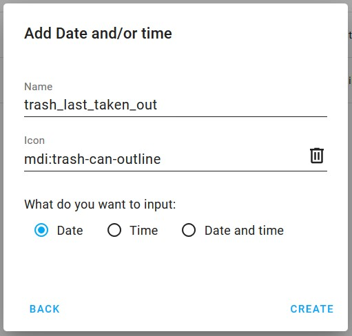
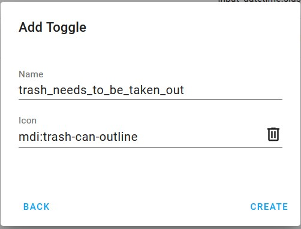
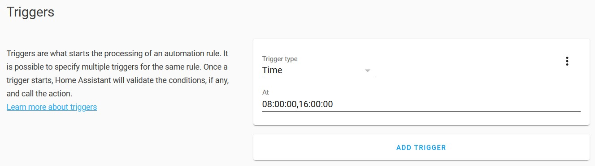
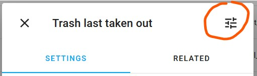
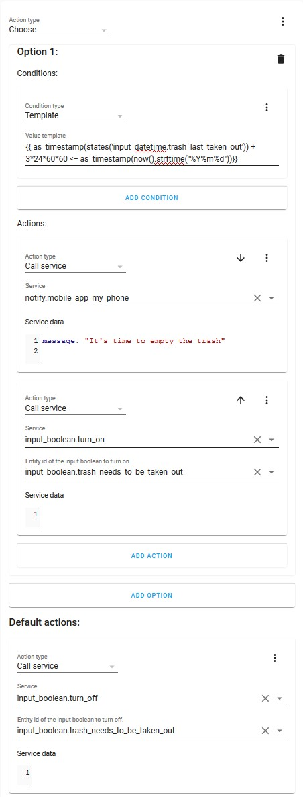
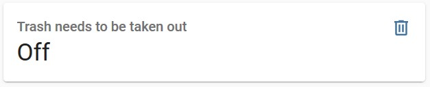
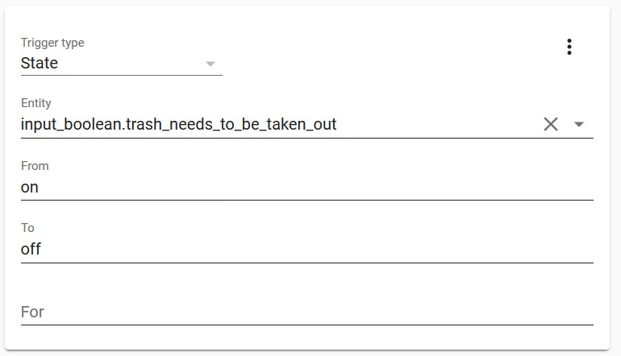

# Periodic Reminders

[Back to the list of all guides](../../README.md)

## Overview

**Difficulty:** easy

This guide will show you how to set up periodic reminders for chores or other actions that need to be performed every few days.

You will create a system, that tracks when a chore was last performed. If more than a specified amount of time has passed (in my case 3 days), I will receive two daily reminders until I perform the action and reset the timer.

## Background

As recycling is becoming more and more widespread, my municipality has mandated that we sort bio-waste seperately from the rest of our waste. I live in an appartment, so it's quite a hassle to bring the bio-waste down to it's container. However, if it isn't done frequently my whole kitchen will end up smelling like a compost pile.

For this reason, I wanted to create a system that would remind me every 3 days to take down the trash, if it hadn't been done. This system can easily be adapted for other actions like replacing batteries every six months, mopping the floor every month or whatever tasks you need to perform at a regular interval.

## Creating the automations

The first step is to create two helpers. The first helper will track the last time the trash was taken out. Go to helpers and create a new helper. I don't care about the time of the day, so I only created a date-helper. However, you could use date-time if you wanted more precision in the notifications.

You can pick an icon from https://materialdesignicons.com/ by writing mdi: and the name of the icon. mdi stands for material design icons.

In theory the date helper i all you need. However, in order to get a nicer user interface, I created another toggle helper, indicating whether or not the trash needs to be taken out.

Now that we have the two helpers, we can begin with the automations. I want to receive notifications once in the 08:00 and another at 16:00, if I haven't taken out the trash by then. So I create a new automation and set a new time trigger to trigger at 08:00 and 16:00.

The next step is to set a condition, so the automation only runs when 3 days have passed since the trash was last taken out.

I want Home Assistant to do one thing if the trash needs to be taken out and another thing if it doesn't need to be taken out. For this reason I won't create any conditions but instead use the Choose action. A Choose action will evaluate a range of conditions and run different actions based on which conditions are true. So I can set one condition checking if enough time has passed and associate that with a set of actions. I can then have a set of default actions that trigger if no conditions are met.

For the condition to be configured, we need to use Home Assistants very powerful templating system. If you go into developer tools and select template you will find a tool where you can write template code and immediately see what it evalutates to. This makes it easy to see what's going on. Try writing:

    {{states('input_datetime.trash_last_taken_out')}}.

You will see that it prints the date set in the helper. You can also write the following to print the current date.

    {{now().strftime("%Y%m%d")}}

If you wrap either of the two in as_timestamp(), it will instead print two large numbers.

    {{as_timestamp(states('input_datetime.trash_last_taken_out'))}}

    {{as_timestamp(now().strftime("%Y%m%d"))}}

These numbers represent the number of seconds since a specific date in the past. That makes it easy to compare them. The following statement is true, when the trash was last taken out on a date prior to the current date. If you go to the helper page and click on the helper a window will show. If you click on the icon to the top right you can change the date to test different dates.

    {{as_timestamp(states('input_datetime.trash_last_taken_out')) < as_timestamp(now().strftime("%Y%m%d"))}}

However, I don't want to be reminded every day, so this isn't good enough. Luckily, since the timestamp is just a number of seconds, we can simply subtract the number of seconds in three days (3 \* 24 \* 60 \* 60) from the current time.

    {{as_timestamp(states('input_datetime.trash_last_taken_out')) < as_timestamp(now().strftime("%Y%m%d")) - 3*24*60*60}}

Now the condition is only true for date three days in the past. Now all we need to do is to setup the automation. I've set up mine to send me a notification as well as to switch the "trash needs to be taken out helper" on when enough time has passed. Otherwise the other helper is switched off. The actions look like this:

Now I can simply create a lovelace entity card for my toggle helper, which will show if the trash needs to be taken out. This will automatically switch to on, and the icon will change color, when the trash needs to be taken out.

There is just one small problem. I currently have no way of reseting the counter, when the trash it taken out. In order to do so, I will create a new automation, that automatically sets the trash_last_taken_out date to the current date, when the toggle helper is switched from on to off.

I create a new automation and set it to trigger whenever the trash_needs_to_be_taken_out toggle switches from on to off.

When this happens I want to reset the time helper. As far as I know, there is no built-in way to do this, that does not require templates. So we will use some template code once again. The built-in editor does not support this, so you need to switch it to edit the yaml.

Write following yaml

    data_template:
      date: '{{ now().timestamp() | timestamp_custom("%Y-%m-%d", true) }}'
    entity_id: input_datetime.trash_last_taken_out
    service: input_datetime.set_datetime

This template takes the current timestamp and formats it as the year (%Y), the month (%m) and the date (%d), which is the correct format for the date field.

That's it. Whenever you turn off the toggle, the time will reset to the current time. When 3 days pass, the system will automatically turn the toggle on and keep notifying me until I toggle it off again and reset the time. If I were to take out the trash early, I just need to turn the toggle on and off again to automatically reset the time.

## Future ideas

Currently the only way to reset the date is to log in to Home Assistant. If you have a button configured with Home Assistant you can use that to reset the toggle. That way you can place the button by the bin, so you won't have to log into Home Assistant.

I may look into creating a custom lovelace card that looks nicer in the interface. This will be a bit more technical, however, but should be doable with some patience.
